# 🚀 Service Management System

Full-featured service management platform with real-time chat, order tracking, invoice generation, and SSL Commerz payment integration.


## ✨ Features

- 🎯 **Multi-Role System** - Admin, Employee portals
- 💬 **Real-Time Chat** - Anonymous user support with Pusher
- 📦 **Order Management** - Complete lifecycle tracking
- 📄 **Invoice System** - Create, edit, and manage invoices
- 💳 **SSL Commerz** - Secure payment gateway integration
- 📱 **Responsive Design** - Mobile, tablet, desktop optimized
- 🌙 **Dark Mode** - Built-in theme support

## 🛠️ Tech Stack

- React 19 + Redux Toolkit
- React Router v7
- Tailwind CSS
- Pusher (Real-time)
- SSL Commerz (Payments)
- Axios

## 🎭 User Roles

- **Login Url** - /login
- **Admin** - Full system access, employee management, analytics - username:admin@gmail.com password:12345678
- **Employee** - Order & invoice management, customer support - username:employee@gmail.com password:12345678
- **Client** - Service requests, order tracking, anonymous chat

## 💬 Chat System

```javascript
import { useChat } from "@/features/chat/hooks/useChat";

// Authenticated users
const chat = useChat(conversationUuid);

// Anonymous users
ChatAPI.setAnonymousUser({
  contact: "user@example.com",
  name: "Guest User",
});
```

## 💳 Payment Flow

1. User selects "Quick Pay" on invoice
2. SSL Commerz payment session initiated
3. Payment completed & validated via webhook
4. Invoice status auto-updates

## 🚀 Build

```bash
npm run build
npm run preview
```

## 🤝 Contributing

1. Fork the repository
2. Create feature branch (`git checkout -b feature/AmazingFeature`)
3. Commit changes (`git commit -m 'Add AmazingFeature'`)
4. Push to branch (`git push origin feature/AmazingFeature`)
5. Open Pull Request

## 📝 License

MIT License - see [LICENSE](LICENSE) file

## 📞 Support

Email: mhrsifat@gmail.com

---

Made with ❤️ | ⭐ Star if you find it helpful!

## Screenshot

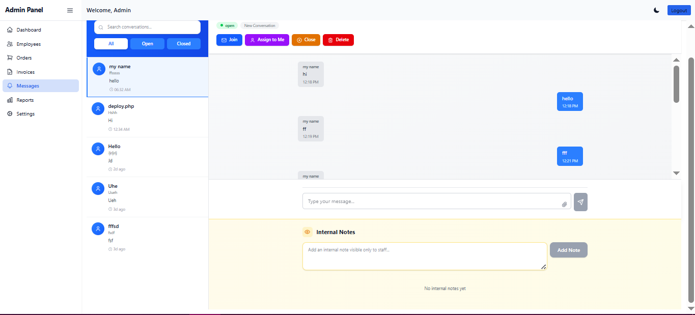

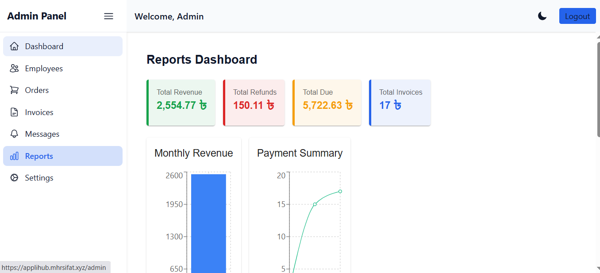

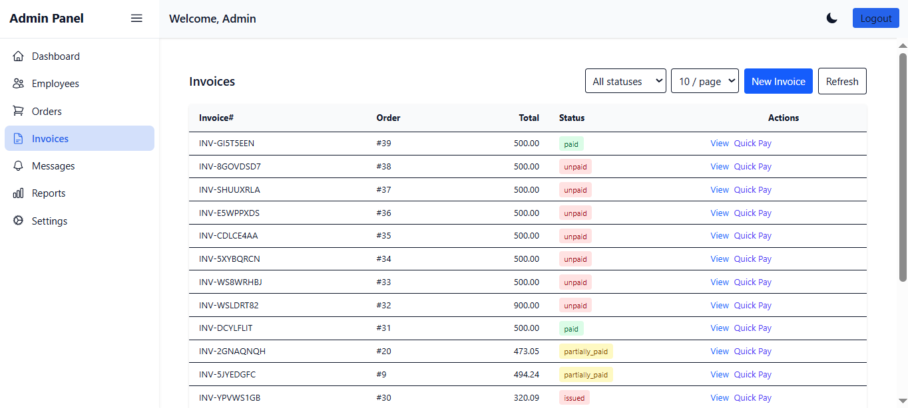

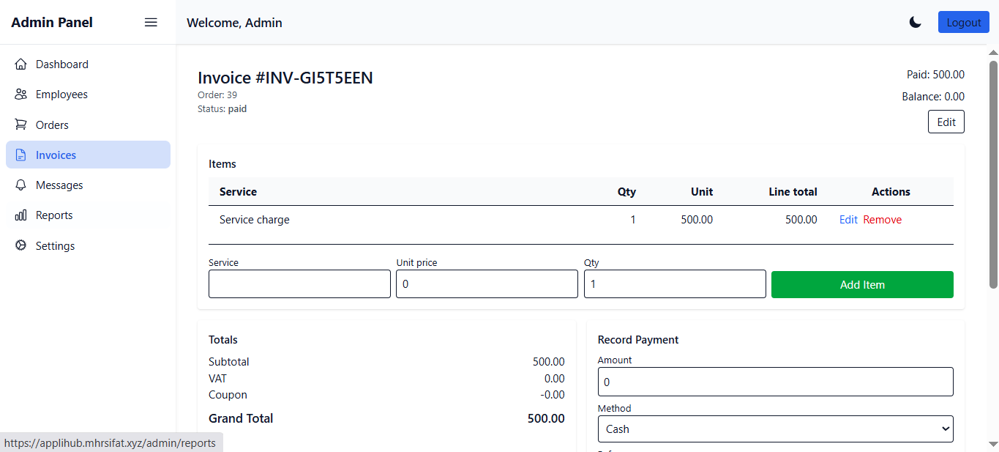

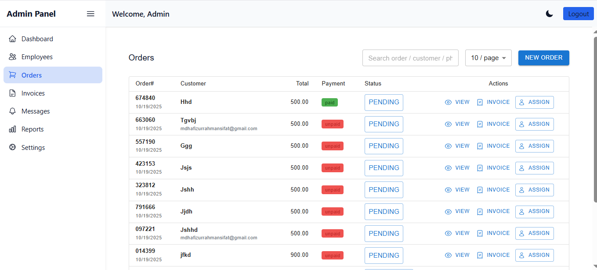

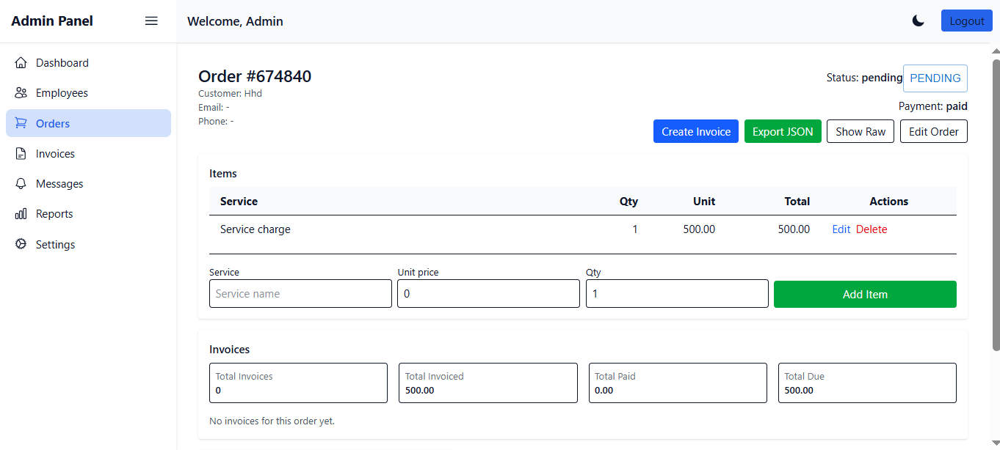

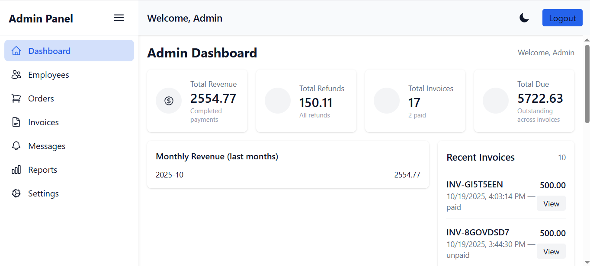

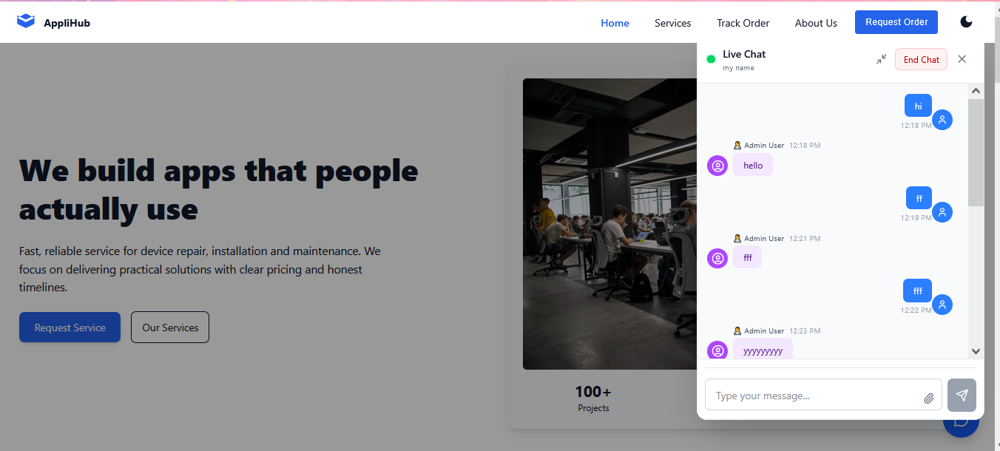

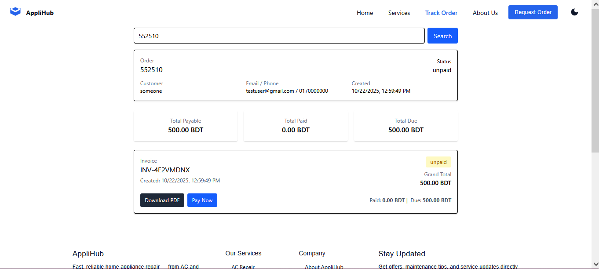

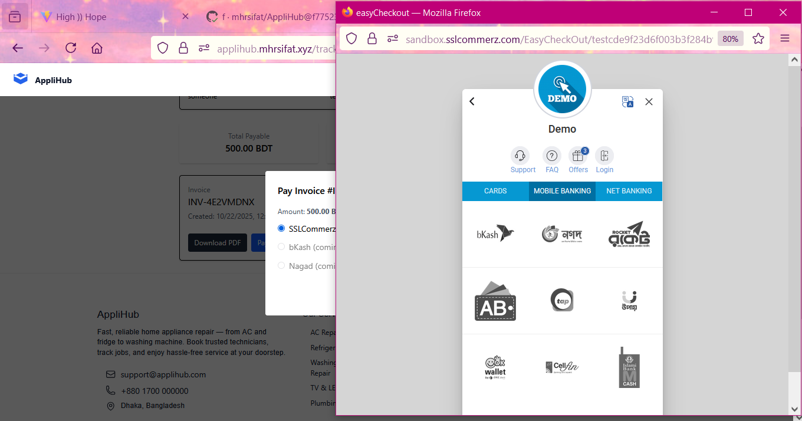

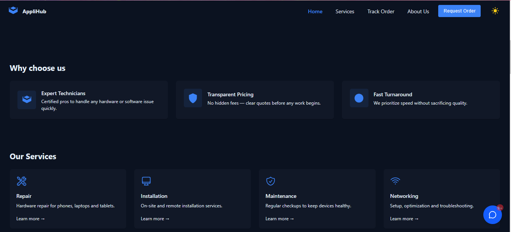
